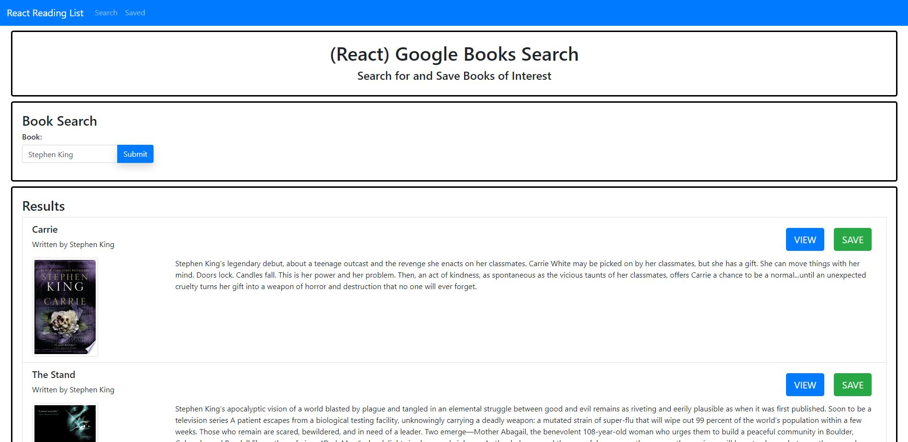

# Google Books Search
UCI Boot Camp Homework 21 - Google Books Search

Click [here](https://mern-books-maxx.herokuapp.com/) to open deployed Github pages application.

## Description 
 This was the twenty-first (and last!) homework assignment for the full stack web development program at UC Irvine, in which the goal was to build a fullstack MERN application that allows the users to search for books (from the Google Books API), save them, view them (in Google Books), and delete them from their saved database.

## Table of Contents 
* [Technologies](#Technologies)
* [Usage](#Usage)
* [License](#License)
* [Badges](#Badges)
* [Tests](#Tests)
* [Questions](#Questions)

## Technologies 
* This application uses MERN (Mongoose, Express, React, and Node.js) for the frontend and backend.
* It uses the Google Books API to retrieve book data.
* The React side uses the React Router for routing between pages as well as Axios for API manipulation.

## Usage 
If using from the Github pages deployed application, just go to the deployed application's [link](https://mern-books-maxx.herokuapp.com/). There are essentially only two pages to this application: the Search page and the Saved page. First, go to the Search page and enter a book keyword in the text box (name of book, author, etc.) and then click submit. The top 10 results will appear, each with a view and save button. The View button brings you to the Google Books page for that back and the Save button saves it to your collection of saved books on the Saved page. The Saved page shows all books which were saved, and allows you to view the book OR delete it using the view and delete buttons, respectively.

## License 
 ISC

## Badges 
 
 

## Tests 
 No tests are currently in place for this project.

## Questions 
 For any questions, contact me at [maxxsanner105@gmail.com](mailto:maxxsanner105@gmail.com).
#### 

